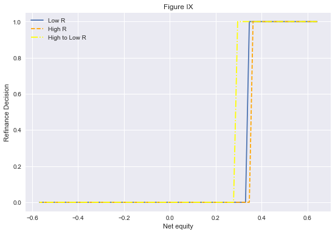

Github Link: https://github.com/HariharanJayashankar/monetary_heter_beraja

# Goals of the notebook

- Replicate figure IX - Switching threshold for different refinancing rates
    - This is done right after calculating the value functions for borrowers
- Replicate figure X - IRFs of consmption and refinance propensity to a mortgage rate decline


```python
import numpy as np
import quantecon as qe
import matplotlib.pyplot as plt
plt.style.use('seaborn')
from numba import njit, prange, vectorize
```


```python
# make this 'full_run' if you want to go with full grid sizes
param_set = 'full_run'
```


```python
if param_set == 'quick_run':
    agrid_size = 30
    ygrid_size = 30
    xgrid_size = 30
elif param_set == 'full_run':
    agrid_size = 64
    ygrid_size = 46
    xgrid_size = 60
```


```python
class borrower():

    def __init__(self,
                 sigma = 2,            # inverse intertemporal elasticity
                 r = 0.03,             # rate on assets
                 beta = 0.95,          # discount rate
                 rmmin = 0.05,         # mortgage rate min
                 rmmax = 0.06,         # mortgage rate max
                 rmsize = 2,           # number of rms
                 gamma = 0.8,          # ltv ratio
                 mu = 0.025,           # house price growth (which is equal to income growth)
                 xmin= -1.025,         # inverse accumulated equity min
                 xmax = 0.45,
                 xsize = xgrid_size,
                 amin = 0,
                 amax = 1,
                 asize = agrid_size,
                 ymin = -0.5,
                 ymax = 0.5,
                 ysize = ygrid_size,
                 sigmay = 0.1,
                 sigmap = 0.065,
                 yshocksize = 3,
                 pshocksize = 3,
                 Fnodes = np.array([0.105, .052]),
                 probF = np.array([0.875, 0.125]),
                 ):

        # == assigning paramters to "self" == #

        (self.sigma, self.r, self.beta, self.rmmin, 
        self.rmmax, self.rmsize, self.gamma, self.mu, 
        self.xmin, self.xmax, self.xsize, self.amin, 
        self.amax, self.asize, self.ymin, self.ymax, 
        self.ysize, self.sigmay, self.sigmap, self.yshocksize, 
        self.pshocksize, self.Fnodes, self.probF) = (sigma, r, beta, rmmin, rmmax, 
        rmsize, gamma, mu, xmin, xmax, xsize, amin, amax, asize, ymin, ymax, 
        ysize, sigmay, sigmap, yshocksize, pshocksize, Fnodes, probF)

        # == getting grids == #
        
        rmnodes = self.rmnodes = np.linspace(rmmin, rmmax, rmsize)
        ynodes = np.linspace(ymin, ymax, ysize)
        
        # xgrid
        xnodes = np.linspace(xmin, xmax, xsize)
        
        # agrid
        # this is not evenly spaced. More nodes at the lower a values
        # this is so that the convexity in the value function
        # is brought out
        anodes = np.empty(asize)
        for i in range(asize):
            anodes[i]=(1.0/(asize-1))*(1.0*(i+1)-1.0)
        for i in range(asize):
            anodes[i]=np.exp(np.log(amax-amin+1)*anodes[i])+amin-1.0
            
        self.anodes = anodes


        # == getting grids and probabilities for shocks == #
        
        mc_y = qe.tauchen(0, sigmay, n=yshocksize)
        self.probyshock = probyshock = mc_y.P[0, :]
        self.yshocknodes = yshocknodes = mc_y.state_values
        self.probyshock_cum = probyshock_cum = np.cumsum(self.probyshock)
        
        mc_p = qe.tauchen(0, sigmap, n=pshocksize)
        self.probpshock = probpshock = mc_p.P[0, :]
        self.pshocknodes = pshocknodes = mc_p.state_values
        self.probpshock_cum = probpshock_cum = np.cumsum(self.probpshock)

        # defining the location of the the x value closest to 0
        # (used when constructing refinance value function)
        self.xreset = np.argmin(np.abs(xnodes))

        # == creating vectors to find closest match after a shock for a, x and y == #
        # These are index values for a given shock and a given level of the variable
        # For example, for a given shock and a given asset value, where is the closest
        # recorded asset value in my grid which corresponds to the resulting asset value
        # from the equation

        xnearest = np.empty((xsize, pshocksize), dtype=int)
        for i in range(xsize):
            for j in range(pshocksize):
                xnearest[i, j] = int(np.argmin(np.abs((xnodes[i] - mu - pshocknodes[j]) - xnodes)))

        anearest = np.empty((asize, pshocksize), dtype=int)
        for i in range(asize):
            for j in range(pshocksize):
                anearest[i, j] = int(np.argmin(np.abs((anodes[i]*np.exp(-mu-pshocknodes[j])) - anodes)))

        ynearest = np.empty((ysize, pshocksize, yshocksize), dtype=int)
        for i in range(ysize):
            for j in range(pshocksize):
                for k in range(yshocksize):
                    ynearest[i,j,k] = int(np.argmin(np.abs((ynodes[i]+yshocknodes[k]-pshocknodes[j]) - ynodes)))

        self.xnearest, self.anearest, self.ynearest = xnearest, anearest, ynearest
        
        # "unlogging" x and y nodes
        self.xnodes = np.exp(xnodes)
        self.ynodes = np.exp(ynodes)


    def unpack_params(self):

        # returns all relevant objects on call
        return (self.sigma, self.r, self.beta, self.rmmin, 
                self.rmmax, self.rmsize, self.gamma, self.mu, 
                self.xmin, self.xmax, self.xsize, self.amin, 
                self.amax, self.asize, self.ymin, self.ymax, 
                self.ysize, self.sigmay, self.sigmap, self.yshocksize, 
                self.pshocksize, self.Fnodes, self.probF,
                self.yshocknodes, self.pshocknodes, 
                self.rmnodes, self.xnodes, self.anodes, 
                self.ynodes, self.probyshock, self.probyshock_cum, 
                self.probpshock, self.probpshock_cum, self.xreset, 
                self.xnearest, self.anearest, self.ynearest)
    
def operator_factory(agent):
    
    (sigma, r, beta, rmmin, rmmax, rmsize, 
     gamma, mu, xmin, xmax, xsize, amin, 
     amax, asize, ymin, ymax, ysize, sigmay, 
     sigmap, yshocksize, pshocksize, Fnodes, 
     probF, yshocknodes, pshocknodes, rmnodes, 
     xnodes, anodes, ynodes, probyshock, 
     probyshock_cum, probpshock, probpshock_cum, 
     xreset, xnearest, anearest, ynearest) = agent.unpack_params()
    

    @vectorize
    def u(c, sigma):
        '''
        CRRA utility
        '''
        if c < 1e-10:
            return -np.inf
        elif sigma == 1:
            return np.log(c)
        else:
            return (c**(1 - sigma))/(1 - sigma)


    @njit(parallel = True)
    def T(vold, vrefi, vnorefi, vrefi_out, vnorefi_out, pol_refi, pol_norefi):
        '''
        bellman operator
        '''
        for a_i in prange(asize):
            for y_i in prange(ysize):
                for x_i in prange(xsize):
                    for r_0i, r_0 in enumerate(rmnodes):
                        for r_1i, r_1 in enumerate(rmnodes):
                            for f_i, f in enumerate(Fnodes):
                                
                                # getting node values for parallelized loops
                                a = anodes[a_i]; x = xnodes[x_i]; y = ynodes[y_i]

                                # == Refinancing value function == #
                                
                                # getting income if hh decides to refinance
                                inc_ref = (a * (1.0 + r) +
                                          y -
                                          gamma * r_1 +
                                          gamma * (1.0 - x) -
                                          f)
                                
                                # getting highest feasible asset choice location on our asset grid
                                idx_ref = np.searchsorted(anodes, inc_ref)
                                
                                max_sofar_refi = -1e10
                                
                                # looping over feasible asset choices
                                for a_1 in range(idx_ref):
                                    a_next = anodes[a_1]

                                    util = u(inc_ref - a_next, sigma)

                                    # expectations of future value
                                    e = 0.0
                                    for ps_i, prob_ps in enumerate(probpshock):
                                        for ys_i, prob_ys in enumerate(probyshock):
                                            for fs_i, prob_fs in enumerate(probF):
                                                e += (
                                                    vold[anearest[a_1, ps_i], 
                                                         ynearest[y_i, ps_i, ys_i], 
                                                         xnearest[xreset, ps_i], 
                                                         r_1i, r_1i, fs_i] *
                                                    prob_ps * prob_ys * prob_fs
                                                )
                                                
                                    val_refi = util + beta * np.exp(mu * (1 - sigma)) * e

                                    if val_refi > max_sofar_refi:
                                        max_sofar_refi = val_refi
                                        a_refi = a_1

                                # == No Refinance == #
                                
                                # getting income if hh decides not to refinance
                                inc_noref = (
                                    a * (1.0 + r) +
                                    y -
                                    gamma * r_0 * x
                                )
                                
                                # getting highest feasible asset choice location on our asset grid
                                idx_noref = np.searchsorted(anodes, inc_noref)

                                max_sofar_norefi = -1e10
                                
                                # looping over feasible asset choices
                                for a_1 in range(idx_noref):

                                    a_next = anodes[a_1]

                                    util = u(inc_noref - a_next, sigma)

                                    # expected future value
                                    e = 0.0
                                    for ps_i, prob_ps in enumerate(probpshock):
                                        for ys_i, prob_ys in enumerate(probyshock):
                                            for fs_i, prob_fs in enumerate(probF):
                                                    e += (
                                                        vold[anearest[a_1, ps_i], 
                                                             ynearest[y_i, ps_i, ys_i], 
                                                             xnearest[x_i, ps_i], 
                                                             r_0i, r_1i, fs_i] *
                                                        prob_ps * prob_ys * prob_fs
                                                    )
                                                    
                                    val_norefi = util + beta * np.exp(mu * (1 - sigma)) * e

                                    if val_norefi > max_sofar_norefi:
                                        max_sofar_norefi = val_norefi
                                        a_norefi = a_1

                                # == allocating values and asset allocations to arrays == #

                                vrefi_out[a_i, y_i, x_i, r_0i, r_1i, f_i] = max_sofar_refi
                                vnorefi_out[a_i, y_i, x_i, r_0i, r_1i, f_i] = max_sofar_norefi

                                pol_refi[a_i, y_i, x_i, r_0i, r_1i, f_i] = a_refi
                                pol_norefi[a_i, y_i, x_i, r_0i, r_1i, f_i] = a_norefi

                                   


    
        
    @njit
    def get_policies(v_refi, v_norefi, pol_refi, pol_norefi):
        '''
        Getting asset saving and consumption 
        policies from value functions
        '''

        # initialize empty "choice" frames
        refichoice = np.empty_like(v_refi)
        achoice = np.empty_like(pol_refi)
        cchoice = np.empty_like(pol_refi)
        policy_matrix = np.empty_like(pol_refi)


        for a_i, a in enumerate(anodes):
            for y_i, y in enumerate(ynodes):
                for x_i, x in enumerate(xnodes):
                    for r_0i, r_0 in enumerate(rmnodes): # old rate
                        for r_1i, r_1 in enumerate(rmnodes): # new rate
                            for f_i, f in enumerate(Fnodes):

                                # == check which value function is higher == #

                                if v_refi[a_i, y_i, x_i, r_0i, r_1i, f_i] > v_norefi[a_i, y_i, x_i, r_0i, r_1i, f_i]:
                                    # refinance
                                    refichoice[a_i, y_i, x_i, r_0i, r_1i, f_i] = 1.0
                                    achoice[a_i, y_i, x_i, r_0i, r_1i, f_i] = pol_refi[a_i, y_i, x_i, r_0i, r_1i, f_i]
                                    cchoice[a_i, y_i, x_i, r_0i, r_1i, f_i] = ((1.0 + r) * a  + y - 
                                                                 (gamma * r_1) + gamma * (1 - x) - 
                                                                 f - anodes[achoice[a_i, y_i, x_i, r_0i, r_1i, f_i]])
                                else:
                                    # doesnt refinance
                                    refichoice[a_i, y_i, x_i, r_0i, r_1i, f_i] = 0.0
                                    achoice[a_i, y_i, x_i, r_0i, r_1i, f_i] = pol_norefi[a_i, y_i, x_i, r_0i, r_1i, f_i]
                                    cchoice[a_i, y_i, x_i, r_0i, r_1i, f_i] = ((1.0 + r) * a + y - 
                                                                 gamma * r_0 * x -
                                                                anodes[achoice[a_i, y_i, x_i, r_0i, r_1i, f_i]])

        return refichoice, achoice, cchoice
    
    
    @njit
    def vfi(T, tol=1e-4, max_iter=1000):
        '''
        value function iterator
        '''
        
        v_in = np.empty((asize,ysize,xsize,rmsize,rmsize,len(Fnodes)))
        vrefi_in = np.empty_like(v_in)
        vnorefi_in = np.empty_like(v_in)
        pol_refi = np.empty_like(v_in, dtype=np.int_)
        pol_norefi = np.empty_like(v_in, dtype=np.int_)
        vrefi_out = np.empty_like(v_in)
        vnorefi_out = np.empty_like(v_in)

        # Set up loop
        i = 0
        error = tol + 1

        while i < max_iter and error > tol:
            T(v_in, vrefi_in, vnorefi_in, vrefi_out, vnorefi_out, pol_refi, pol_norefi)
            i += 1
            error = max(
                np.max(np.abs(vrefi_in - vrefi_out)),
                np.max(np.abs(vnorefi_in - vnorefi_out))
            )
            vrefi_in, vnorefi_in = vrefi_out, vnorefi_out
            v_out = np.maximum(vrefi_in, vnorefi_in)
            v_in = v_out

        return v_out, vrefi_out, vnorefi_out, pol_refi, pol_norefi, error
        
    return T, get_policies, vfi
```


```python
# == initialize agent and operators we need == #
hh = borrower()
T, get_policies, vfi = operator_factory(hh)
```


```python
%%time
v_star, vrefi_out, vnorefi_out, pol_refi, pol_norefi, error = vfi(T, tol=1e-4, max_iter=1000)
```

    Wall time: 16.3 s
    


```python
f, ax = plt.subplots(nrows = 2, ncols = 3, figsize = (15, 5))
ax[0, 0].plot(hh.anodes, v_star[:, 0, 0, 0, 0, 0], label = 'Assets')
ax[0, 1].plot(hh.ynodes, v_star[0, :, 0, 0, 0, 0], label = 'Income')
ax[0, 2].plot(hh.xnodes, v_star[0, 0, :, 0, 0, 0], label = 'Inverse Equity')
ax[1, 0].plot(hh.rmnodes, v_star[0, 0, 0, :, 0, 0], label = 'Old Rate')
ax[1, 1].plot(hh.rmnodes, v_star[0, 0, 0, 0, :, 0], label = 'New Rate')
ax[1, 2].plot(hh.Fnodes, v_star[0, 0, 0, 0, 0, :], label = 'Refinance Fixed Cost')
f.suptitle("Value Function")
for i in range(2):
    for j in range(3):
        ax[i,j].legend()
plt.show()
```


```python
f, ax = plt.subplots(nrows = 2, ncols = 3, figsize = (15, 5))
ax[0, 0].plot(hh.anodes, vrefi_out[:, 0, 0, 0, 0, 0], label = 'Assets')
ax[0, 1].plot(hh.ynodes, vrefi_out[0, :, 0, 0, 0, 0], label = 'Income')
ax[0, 2].plot(hh.xnodes, vrefi_out[0, 0, :, 0, 0, 0], label = 'Inverse Equity')
ax[1, 0].plot(hh.rmnodes, vrefi_out[0, 0, 0, :, 0, 0], label = 'Old Rate')
ax[1, 1].plot(hh.rmnodes, vrefi_out[0, 0, 0, 0, :, 0], label = 'New Rate')
ax[1, 2].plot(hh.Fnodes, vrefi_out[0, 0, 0, 0, 0, :], label = 'Refinance Fixed Cost')
f.suptitle("Value Function - Refinance")
for i in range(2):
    for j in range(3):
        ax[i,j].legend()
plt.show()
```


```python
f, ax = plt.subplots(nrows = 2, ncols = 3, figsize = (15, 5))
ax[0, 0].plot(hh.anodes, vnorefi_out[:, 0, 0, 0, 0, 0], label = 'Assets')
ax[0, 1].plot(hh.ynodes, vnorefi_out[0, :, 0, 0, 0, 0], label = 'Income')
ax[0, 2].plot(hh.xnodes, vnorefi_out[0, 0, :, 0, 0, 0], label = 'Inverse Equity')
ax[1, 0].plot(hh.rmnodes, vnorefi_out[0, 0, 0, :, 0, 0], label = 'Old Rate')
ax[1, 1].plot(hh.rmnodes, vnorefi_out[0, 0, 0, 0, :, 0], label = 'New Rate')
ax[1, 2].plot(hh.Fnodes, vnorefi_out[0, 0, 0, 0, 0, :], label = 'Refinance Fixed Cost')
f.suptitle("Value Function - No Refinance")
for i in range(2):
    for j in range(3):
        ax[i,j].legend()
plt.show()
```


```python
%%time
refichoice, achoice, cchoice = get_policies(vrefi_out, vnorefi_out, pol_refi, pol_norefi)
```

    Wall time: 704 ms
    


```python
f_val=0
a_val=1
y_val=4
f, ax = plt.subplots(figsize = (9, 6))
ax.plot(1 - hh.xnodes, refichoice[a_val,y_val,:,0,0,f_val], label = 'Low R')
ax.plot(1 - hh.xnodes, refichoice[a_val,y_val,:,1,1,f_val], label = 'High R', linestyle = '--', color = 'orange')
ax.plot(1 - hh.xnodes, refichoice[a_val,y_val,:,1,0,f_val], label = 'High to Low R', linestyle = '-.', color = 'yellow')
ax.set_title('Figure IX')
ax.set_xlabel('Net equity')
ax.set_ylabel('Refinance Decision')
ax.legend()
plt.show()
```





The switch threshold is off in the above figure. Beraja et al get that at low R, the household refinances at ~0.4 net equity.

Lets start making the simulation into the steady state to get the stationary distribution

Pseudo code:

```
for r in range(regions):
    for hh in range(households):
        for t in time T:
            for ps, ys and Fs in shocks:
                refichoice_{r,hh}(shocks, other vars)
                achoice_{r,hh}(shocks, other vars)
                chcoice_{r,hh}(shocks, other vars)
```


```python
# == scratch simulating into the future == #

n_hh = 5_000 # the final number of households is actually 50k.
n_reg = 9
T = 400

# creating array of regions based on number of households (roughly)
hh_reg = np.empty(0)
for i in range(n_reg):
    hh_reg = np.append(hh_reg,
                       np.repeat((i+1), np.round(n_hh/n_reg)))

# initial values
a_0 = 0
y_0 = 22
x_0 = hh.xreset
r0_0 = 1 
r1_0 = 1
f_0 = 1

```


```python

```
